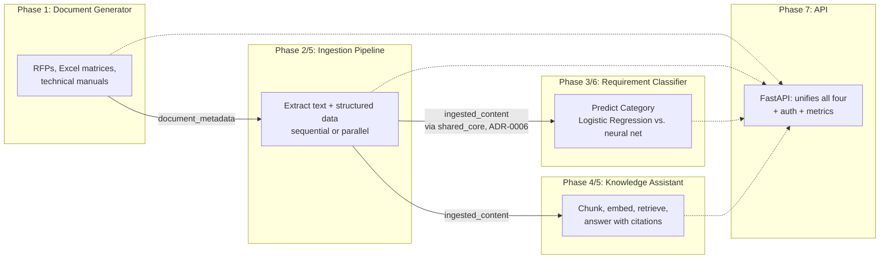

# System Overview

A guide for anyone encountering this repository for the first time:
what this platform does, how its seven phases fit together, and where
to find the detailed design behind each piece.

## What this is

A self-hosted, open-source AI platform that generates synthetic
enterprise documents, extracts and understands their content, and
answers questions about them — built incrementally as a structured
learning journey, with every feature designed before it was coded (see
`docs/architecture/adr/` and `docs/architecture/features/`).

## How the phases connect

**The corpus flows in one direction**: Phase 1 generates it, Phase 2
extracts it into two shared tables (`document_metadata`,
`ingested_content` — the single source of truth defined in
`shared_core`, ADR-0006), and Phases 3 and 4 both read from that same
extracted content independently, for two different purposes
(classification and retrieval-augmented answering). Phase 7 doesn't add
a new capability — it's the front door to the four that already exist.

## The six independent projects

| Project | Phase(s) | Owns | Reads |
|---|---|---|---|
| `backend/` (document_generator) | 1 | `document_metadata` | — |
| `backend/shared_core/` | — (ADR-0006) | Table definitions only | — |
| `backend/ingestion_pipeline/` | 2, 5 | `ingested_content` | `document_metadata` |
| `backend/requirement_classifier/` | 3, 6 | Model artifacts | `ingested_content` |
| `backend/knowledge_assistant/` | 4, 5 | `document_chunks` | `ingested_content` |
| `backend/api/` | 7 | — | Calls into all of the above |

Each is its own `uv` project with its own virtual environment and
dependencies (ADR-0003) — Faker and fpdf2 have no reason to be
installed alongside sentence-transformers and scikit-learn. The
recurring cost of that isolation (a workspace auto-discovery quirk hit
three times, documented in ADR-0003) was worth paying once each new
module made a genuine dependency-isolation problem real, rather than
merging everything into one project to avoid the friction.

## Phase-by-phase, with real results

| Phase | What it proved | Real result |
|---|---|---|
| 1 | Synthetic data generation with realistic structure | 3 document types, category-correlated text (ADR-0004) |
| 2 | Orchestrated extraction (Apache Airflow) | Idempotent, fault-isolated ingestion |
| 3 | Classical ML on the extracted content | 83.5% accuracy vs. 17.5% baseline |
| 4 | Local, self-hosted RAG | GPU-accelerated grounded answers, verified anti-hallucination |
| 5 | Evidence-based performance optimization | 15.3x (embedding batching), ~6.4x (parallel ingestion) |
| 6 | Honest model comparison | Logistic Regression beat a neural network — confirmed, not assumed |
| 7 | Productization | Unified API, auth, metrics, CI |

## Where to go next

- **A specific decision's reasoning**: `docs/architecture/adr/` (8
  ADRs, one per significant architectural choice).
- **A specific feature's full design**: `docs/architecture/features/`
  (one document per phase, including real implementation notes added
  after building each).
- **What changed in each release**: `docs/releases/` (`v0.1.0` through
  `v0.7.0`), or the GitHub Releases page for the same content with
  working cross-links.
- **How to run it yourself**: the root `README.md`'s Quick Start.
