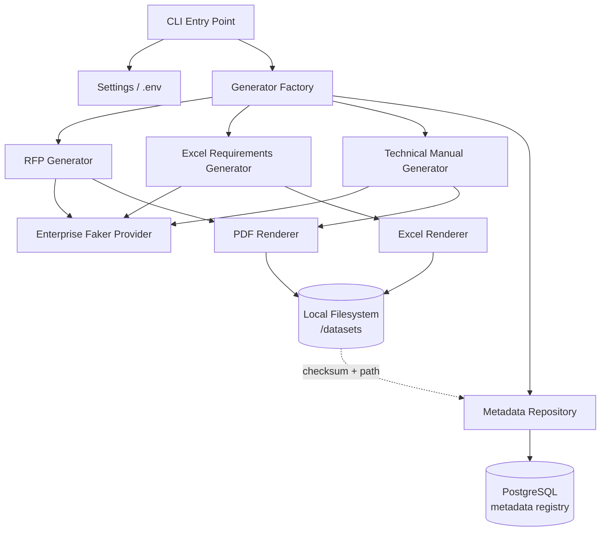

# Feature 0001: Synthetic Enterprise Document Generator

## Problem Statement

The platform needs a realistic corpus of enterprise business documents
(RFPs, technical requirement spreadsheets, and technical manuals) to
serve as the foundation for every later phase of the project: ingestion
pipelines, requirement classification, and the RAG-based knowledge
assistant. Since the project must never use real confidential or
proprietary information, this corpus must be entirely synthetic, yet
structurally realistic enough that downstream ML/NLP components face the
same challenges they would face with real enterprise data (inconsistent
formatting, mixed document types, embedded tables, varying document
length).

Without this generator, every later phase would either depend on
manually created sample files (not scalable, not reproducible) or on
real-world scraped documents (violates the project's constraints).

## Functional Requirements

| ID | Requirement |
|----|-------------|
| FR1 | The system shall generate synthetic RFP documents in PDF format, containing a fictional issuing company, project scope, budget range, and technical requirements section. |
| FR2 | The system shall generate synthetic Excel workbooks containing technical requirement matrices (requirement ID, description, category, priority, source RFP reference). |
| FR3 | The system shall generate synthetic technical manuals in PDF format with structured sections (introduction, specifications, procedures, appendix). |
| FR4 | The system shall persist metadata for every generated document (document type, file path, SHA-256 checksum, generation timestamp, related fictional entity, random seed used) into PostgreSQL. |
| FR5 | The system shall support deterministic, reproducible generation via a configurable random seed. |
| FR6 | The system shall allow the number of documents per type and the output directory to be configured without code changes (CLI arguments and/or a config file). |
| FR7 | The system shall avoid producing duplicate documents by checksum within the same generation run. |
| FR8 | The system shall be extensible to new document types without modifying the core generation engine (open/closed principle). |

## Non-Functional Requirements

| ID | Requirement |
|----|-------------|
| NFR1 | **Reproducibility**: identical seed + identical parameters must produce identical output, enabling deterministic tests. |
| NFR2 | **Testability**: document generators must be unit-testable without requiring a live PostgreSQL instance. |
| NFR3 | **Extensibility**: adding a new document type should require adding a new generator class, not modifying existing ones. |
| NFR4 | **Observability**: every generation run must produce structured logs (start/end, count generated, failures, duration). |
| NFR5 | **Portability**: the system must run fully via Docker Compose, with no dependency on any cloud provider. |
| NFR6 | **Data integrity**: every stored file must be verifiable via its recorded checksum. |
| NFR7 | **Performance**: generating 100 documents of mixed type must complete in under 60 seconds on commodity hardware (baseline to be validated; revisited in the Phase 5 Performance Lab). |

## Architecture Overview

**Flow**: the CLI reads configuration, asks the Generator Factory for the
requested document type(s), each generator uses a shared enterprise
Faker provider to produce fictional entities and content, renders the
result through the appropriate renderer (PDF or Excel), writes the file
to the local filesystem, computes its checksum, and records the metadata
through a repository abstraction into PostgreSQL.

## Design Decisions

1. **Strategy/Factory pattern for generators.** Each document type
   (RFP, Excel matrix, manual) is implemented as an independent class
   conforming to a common `DocumentGenerator` interface. The factory
   selects the right generator based on the requested type. This
   satisfies FR8 and NFR3: adding a new type (e.g., a "meeting minutes"
   generator later) means adding a new class, not editing existing code.

2. **Repository pattern for metadata persistence.** Database access is
   isolated behind a `DocumentMetadataRepository` interface, with a
   PostgreSQL/SQLAlchemy implementation. This directly satisfies NFR2:
   unit tests can inject an in-memory fake repository instead of
   requiring a live database, keeping the test suite fast.

3. **Pydantic models for configuration and metadata.** Both the runtime
   settings (via `pydantic-settings`, reading from `.env`) and the
   document metadata records are typed models, not dictionaries. This
   catches configuration and data errors early, consistent with the
   project's "typed Python" coding standard.

4. **SHA-256 checksums for every generated file.** Enables FR7
   (duplicate detection within a run) and NFR6 (integrity verification),
   and lays groundwork for future deduplication when the corpus grows in
   later phases.

5. **CLI framework: `Typer`.** Chosen over the standard-library
   `argparse` because it generates a self-documenting `--help` output
   from type hints with minimal boilerplate, which matters for a
   portfolio project where code clarity is itself part of the
   deliverable. See trade-off table below.

## Trade-off Analysis

| Decision point | Option chosen | Alternative considered | Why |
|---|---|---|---|
| PDF rendering | `fpdf2` | `reportlab`, `WeasyPrint` | `reportlab` is more powerful but has a steeper, more verbose API for a first iteration. `WeasyPrint` (HTML/CSS → PDF) is more flexible for complex layouts but pulls in native system dependencies (Cairo/Pango), adding friction to the Docker image. `fpdf2` is pure-Python, lightweight, and sufficient for structured business documents. If document layouts become significantly more complex (e.g., in Phase 6, Document Understanding), this decision should be revisited via a new ADR. |
| CLI framework | Typer | argparse (stdlib) | argparse has zero dependencies, which matters for a minimal footprint, but Typer's type-hint-driven interface reduces boilerplate and produces better `--help` documentation with almost no extra code — a good trade for a portfolio project meant to be read by others. |
| Storage strategy | Files on disk + metadata in PostgreSQL | Documents as BLOBs inside PostgreSQL | See **ADR-0002** below — this decision has broader architectural consequences and is documented separately. |
| Metadata repository | Repository pattern (interface + PostgreSQL implementation) | Direct SQLAlchemy calls inside generators | Direct calls are faster to write initially but couple business logic to persistence, making unit tests slower and harder to isolate. The repository pattern costs a small amount of extra boilerplate now in exchange for testability that will matter increasingly as more phases depend on this module. |

## Testing Strategy

- **Unit tests** (`pytest`) for each generator class, using a fixed
  random seed and asserting structural properties of the output (e.g.,
  the PDF has the expected number of sections, the Excel file has the
  expected columns and at least N rows) rather than asserting exact
  byte-for-byte content, which would make tests brittle.
- **Fake repository** implementing the same interface as the PostgreSQL
  repository, used in all unit tests to avoid requiring a live database
  connection.
- **Integration test** (marked separately, run via `docker compose up -d
  postgres` in CI) that exercises the real PostgreSQL repository against
  a disposable database, verifying that metadata written by a generation
  run can be correctly read back.
- **Reproducibility test**: running the generator twice with the same
  seed must produce files with identical checksums, directly validating
  NFR1.

## Related ADRs

- ADR-0001: Repository strategy (monorepo)
- ADR-0002: Document storage strategy (filesystem + PostgreSQL metadata,
  vs. database BLOBs)

## Future Improvements

- Add a `minio`/S3-compatible object storage backend as an alternative
  to the local filesystem, to better simulate a distributed deployment
  (candidate for a later phase, not required now — would over-engineer
  Phase 1).
- Add content variability controls (document length, language
  complexity) to support later ML training needs (Phase 3, Requirement
  Intelligence Engine).
- Add a `--dry-run` mode for previewing generation without writing files
  or database records.
