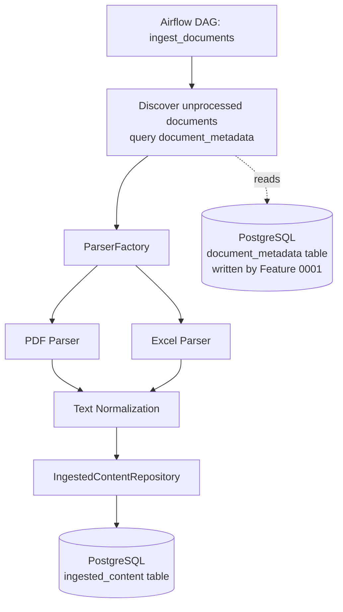

# Feature 0002: Document Intelligence Pipeline

## Problem Statement

Feature 0001 produces a corpus of synthetic documents (PDF and XLSX)
with metadata recorded in PostgreSQL, but the actual *content* of those
documents remains locked inside binary files. Every later phase of the
project — the ML requirement classifier (Phase 3) and the RAG knowledge
assistant (Phase 4) — needs that content available as structured,
queryable text, not as opaque PDF/XLSX bytes on disk.

This feature builds the pipeline that extracts, cleans, and persists
that content, orchestrated by Airflow so it can run automatically
whenever new documents appear, rather than requiring a manual script
run.

## Functional Requirements

| ID | Requirement |
|----|-------------|
| FR1 | The system shall extract full text content from PDF documents (RFPs and technical manuals). |
| FR2 | The system shall extract structured rows from Excel requirement matrices (preserving column structure: Requirement ID, Description, Category, Priority, Source RFP Reference). |
| FR3 | The system shall persist extracted content into PostgreSQL, linked to the originating document's metadata record via its checksum. |
| FR4 | The system shall normalize extracted text (collapse excess whitespace, strip control characters) before storage. |
| FR5 | The system shall be orchestrated via an Airflow DAG that discovers documents recorded in `document_metadata` which have not yet been ingested. |
| FR6 | The system shall be idempotent: re-running the pipeline must not create duplicate ingested-content records for the same document. |
| FR7 | The system shall be extensible to new document types via a new parser class, without modifying existing parser code (Open/Closed Principle, mirroring Feature 0001's generator design). |
| FR8 | A single document that fails to parse shall not stop the processing of the remaining documents in the same run. |

## Non-Functional Requirements

| ID | Requirement |
|----|-------------|
| NFR1 | **Idempotency**: enforced at the data layer, not just application logic (e.g., a uniqueness constraint), so it holds even under concurrent or retried runs. |
| NFR2 | **Testability**: parser logic must be unit-testable without requiring Airflow or a live database connection. |
| NFR3 | **Extensibility**: adding a parser for a new document type requires one new class plus one factory registration, matching the pattern validated in Feature 0001. |
| NFR4 | **Observability**: every pipeline run logs counts of documents processed, skipped (already ingested), and failed. |
| NFR5 | **Fault isolation**: a corrupt or unreadable file is caught and recorded as a failed record, not an unhandled exception that crashes the whole DAG run. |
| NFR6 | **Traceability**: every ingested-content record references the exact checksum of the source document, so extracted text can always be traced back to a specific file version. |

## Architecture Overview

**Flow**: the Airflow DAG queries `document_metadata` for documents
whose checksum does not yet exist in `ingested_content` (this is the
idempotency check, FR6/NFR1). For each pending document, the factory
selects the parser matching its document type, extracts and normalizes
the content, and persists it through the repository. A failure in one
document's parsing is caught and recorded per-document, without
aborting the batch (NFR5).

## Design Decisions

1. **Independent uv project** (`backend/ingestion_pipeline/`) — see
   ADR-0003.

2. **Strategy/Factory pattern for parsers**, mirroring Feature 0001's
   generator design exactly. A `DocumentParser` interface with
   `PDFParser` and `ExcelParser` implementations, selected by a
   `ParserFactory`. This is a deliberate consistency choice: once a
   pattern is proven to work (Open/Closed extensibility, testability
   via dependency injection), reusing it elsewhere in the same codebase
   reduces cognitive load for anyone reading the repository.

3. **Database-level idempotency**: `ingested_content.source_checksum`
   has a `UNIQUE` constraint, not just an application-level check before
   insert. Application-level checks alone have a race condition if two
   runs ever overlap; a database constraint is the actual source of
   truth for uniqueness.

4. **Per-document failure isolation**: each document is processed in
   its own try/except block, with failures recorded as rows with a
   `status='failed'` and an `error_message`, rather than raising and
   stopping the whole DAG task. This satisfies FR8/NFR5, and also means
   failed documents are queryable later ("show me everything that
   failed to parse and why") instead of only visible in a log file.

## Trade-off Analysis

| Decision point | Option chosen | Alternative considered | Why |
|---|---|---|---|
| PDF text extraction | `pdfplumber` | `PyPDF2`/`pypdf`, `PyMuPDF` | `pdfplumber` has a simpler, more Pythonic API for plain text extraction and is well-maintained; `PyMuPDF` is faster but has a more complex API and a less permissive license (AGPL) that doesn't fit "Open Source First" as cleanly for a project that might productize later. |
| Idempotency enforcement | Database unique constraint | Application-level `exists()` check only | A constraint is enforced regardless of which code path writes to the table, including future code the current design didn't anticipate — a stronger guarantee for the same implementation cost. |
| Excel parsing | `pandas.read_excel` | `openpyxl` directly | Feature 0001 already writes Excel via pandas; reading it back the same way keeps a consistent mental model of "the DataFrame is the shape of the data" across the generator and the pipeline. |
| Failure handling granularity | Per-document try/except | Per-batch (fail the whole DAG run on first error) | A single malformed file failing the entire batch would block ingestion of dozens of valid documents — unacceptable for a pipeline meant to run unattended on a schedule. |

## Testing Strategy

- **Unit tests** for `PDFParser` and `ExcelParser`, using files
  generated by Feature 0001's generators directly (dogfooding — the two
  features already share a "shape of truth" for what counts as a valid
  RFP/manual/matrix).
- **Fake repository** for `IngestedContentRepository`, matching the
  pattern from Feature 0001 — parser tests never require PostgreSQL.
- **Idempotency test**: ingesting the same document twice must result
  in exactly one `ingested_content` row.
- **Fault isolation test**: a deliberately corrupted file in a batch of
  otherwise-valid documents must not prevent the valid ones from being
  ingested, and must produce a `status='failed'` record for itself.

## Related ADRs

- ADR-0001: Repository strategy (monorepo)
- ADR-0002: Document storage strategy (filesystem + PostgreSQL metadata)
- ADR-0003: Module structure for Phase 2 (independent uv project)

## Future Improvements

- Extract a shared internal package for the `document_metadata` schema
  once a third module needs to read/write it (see ADR-0003
  consequences).
- Add OCR fallback (e.g., Tesseract) for any future scanned-document
  support — not needed now since all Phase 1 PDFs contain real text,
  not images.
- Replace the polling-based "discover unprocessed documents" query with
  an event-driven trigger (e.g., a message queue) if document volume
  ever grows enough to make polling inefficient — explicitly out of
  scope for this phase's data volumes.

## Implementation Notes (post-completion)

The design above was implemented in full, with three notable
discoveries during implementation that are worth recording here as
lessons, not just fixed in code silently:

1. **uv workspace auto-discovery broke dependency isolation.** Placing
   `ingestion_pipeline/` as a subdirectory of `backend/` caused `uv` to
   automatically treat it as a workspace member, sharing a single
   `.venv` between both projects and silently uninstalling
   `document-generator`'s own dependencies during `ingestion_pipeline`'s
   `uv sync`. Fixed via an explicit `[tool.uv.workspace]` `exclude`
   entry in `backend/pyproject.toml` (see ADR-0003).

2. **Relative file paths broke across process boundaries.**
   `document_metadata.file_path` was originally stored relative to the
   writer's working directory. The moment a different process
   (`ingestion_pipeline`, run from a different directory) tried to
   read it, every file lookup failed. Fixed by storing absolute paths
   at generation time in Feature 0001's `DocumentGenerator.generate()`.

3. **Airflow's custom-image dependency installation required
   Airflow's own constraints file.** Installing `pdfplumber`, `pandas`,
   and `sqlalchemy` without constraints let `pip` upgrade `sqlalchemy`
   past the version Airflow 2.9.3's own ORM models are compatible with,
   breaking the scheduler at import time. Fixed by installing with
   `--constraint` against Airflow's official constraints file for
   2.9.3/Python 3.12. This in turn pinned SQLAlchemy below 2.0, which
   broke `repository.py`'s use of the 2.0-only `DeclarativeBase` class
   — resolved by switching to the function-based `declarative_base()`,
   which is source-compatible with both the constrained version inside
   the Airflow container and the newer SQLAlchemy used in the local
   `ingestion_pipeline` virtual environment.

All three were caught by actually running the system end-to-end against
live PostgreSQL and a real Airflow container, not by unit tests alone —
a reminder that integration validation catches an entire class of
issues (environment mismatches, dependency conflicts, cross-process
assumptions) that isolated unit tests structurally cannot.
