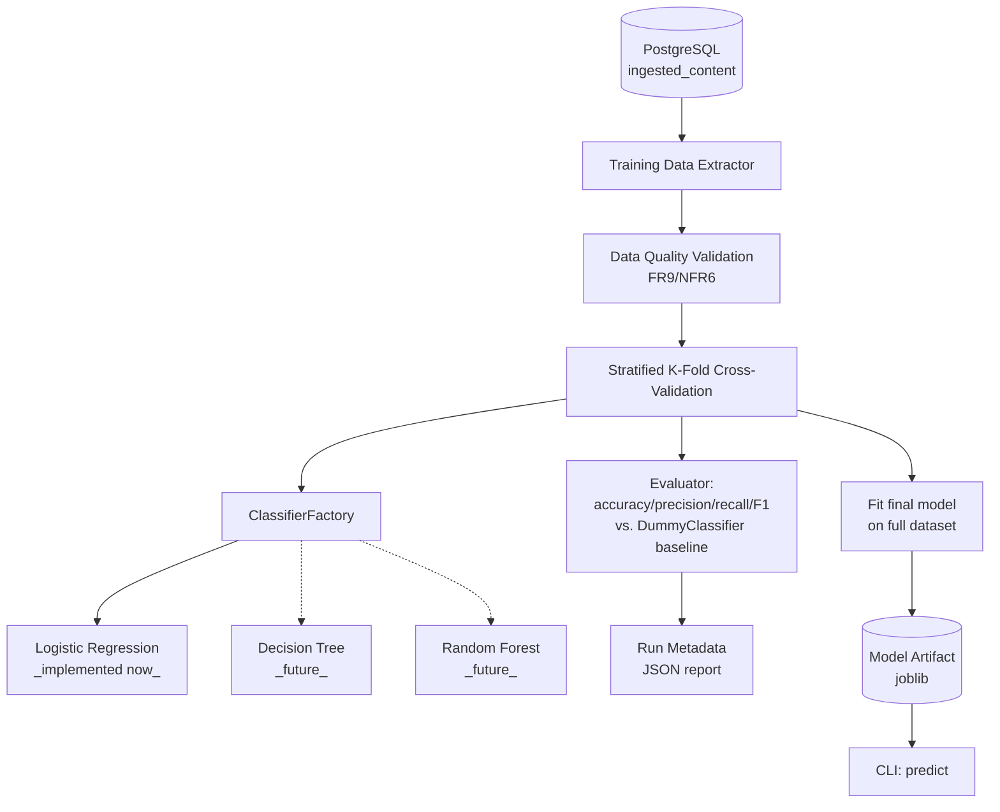

# Feature 0003: Requirement Intelligence Engine

## Problem Statement

Phase 2 leaves the platform with a growing corpus of labeled requirement
records (Description, Category, Priority) sitting in
`ingested_content.structured_data`, extracted automatically from every
generated Excel requirement matrix. That data is currently inert —
nothing reads it back out for analysis.

In a real enterprise RFP process, triaging incoming requirements by
category and urgency is a manual, repetitive task typically done by a
solution architect or business analyst reading each line one by one.
This feature builds a classical machine learning classifier that
automates that triage: given a requirement's text, predict its Category
(and, as a stretch, its Priority), demonstrating the full classical ML
lifecycle — data preparation, feature extraction, model training,
rigorous evaluation, and persistence for reuse — as the Phase 3
milestone of the portfolio.

## Functional Requirements

| ID | Requirement |
|----|-------------|
| FR1 | The system shall extract all labeled requirement records (Description, Category, Priority) from `ingested_content.structured_data` across every `excel_requirements` document. |
| FR2 | The system shall train a text classification model predicting Category from Description text. |
| FR3 | The system shall evaluate the model using stratified k-fold cross-validation (not a single train/test split), reporting mean and standard deviation of accuracy, precision, recall, and F1 across folds. |
| FR4 | The system shall compare model performance against a majority-class baseline (`DummyClassifier`), to demonstrate genuine learned signal rather than an artifact of class imbalance. |
| FR5 | The system shall persist the trained model artifact (fit on the full dataset) so it can be reused for inference without retraining. |
| FR6 | The system shall persist run metadata (model type, hyperparameters, cross-validation metrics, dataset size, timestamp, seed) alongside the model artifact. |
| FR7 | The system shall expose a CLI command to classify a new, previously unseen requirement description. |
| FR8 | The system shall be extensible to additional classifier types (Decision Tree, Random Forest, SVM) without modifying the training/evaluation pipeline itself. |
| FR9 | The system shall fail fast with a clear error if the extracted dataset is too small or too imbalanced to train meaningfully (e.g., fewer than 10 examples in any class). |

## Non-Functional Requirements

| ID | Requirement |
|----|-------------|
| NFR1 | **Reproducibility**: a fixed random seed controls the cross-validation fold assignment and any stochastic model training, so results are repeatable. |
| NFR2 | **Testability**: the training pipeline is testable against a small synthetic dataset, without requiring a live PostgreSQL connection for unit tests. |
| NFR3 | **Extensibility**: swapping the underlying classifier (Strategy pattern, matching Feature 0001/0002's design) requires no changes to data extraction, evaluation, or persistence code. |
| NFR4 | **Observability**: every training run logs its metrics in a structured, comparable format — enabling future runs to be compared against past ones. |
| NFR5 | **Light explainability**: the design allows inspecting the most predictive terms per class (available directly from a linear model's coefficients), supporting both debugging and portfolio narrative. |
| NFR6 | **Data quality validation**: the pipeline validates dataset size and class balance before training, rather than training silently on insufficient data and producing misleading metrics. |

## Architecture Overview

**Flow**: the extractor reads every `excel_requirements` record from
`ingested_content` into a flat table (Description, Category, Priority).
After validating the dataset meets minimum size/balance thresholds, the
pipeline runs stratified k-fold cross-validation using a
`TfidfVectorizer` + classifier pipeline selected via the
`ClassifierFactory`, evaluating against a majority-class baseline. A
final model is fit on the entire dataset and persisted as a joblib
artifact, alongside a JSON file recording the run's metrics and
configuration. A CLI command loads the artifact to classify new text.

## Design Decisions

1. **Independent uv project** (`backend/requirement_classifier/`),
   continuing the pattern established in ADR-0003: scikit-learn,
   pandas, and joblib have no reason to be installed alongside the
   document generator's or ingestion pipeline's dependencies.

2. **Stratified k-fold cross-validation instead of a single train/test
   split** (FR3). With roughly 200 labeled examples across 8 categories
   (~25 each), a single 80/20 split would leave very few examples per
   class in the test set, making the resulting metric noisy and
   unreliable. K-fold cross-validation uses every example for both
   training and evaluation across folds, giving a much more stable
   estimate of real performance — the statistically correct choice for
   a dataset this size.

3. **Baseline comparison is a first-class part of evaluation, not an
   afterthought** (FR4). This is a direct, permanent response to the
   lesson from ADR-0004: a model's accuracy number means nothing in
   isolation. Every training run reports the model's metrics *next to*
   what a naive "always predict the most common class" strategy would
   achieve, making it immediately visible whether the model is doing
   genuine work.

4. **Strategy/Factory pattern for classifiers** (FR8/NFR3), the same
   pattern validated twice already (document generators, document
   parsers). `ClassifierFactory` maps a model name to a scikit-learn
   estimator; adding Decision Tree or Random Forest support later means
   adding one entry, not touching the training/evaluation pipeline.

5. **TF-IDF for feature extraction**, not pretrained embeddings.
   Embeddings are architecturally closer to Phase 4 (the RAG knowledge
   assistant), which already plans to introduce them properly with a
   vector database. Using TF-IDF here keeps Phase 3 scoped to classical
   ML, consistent with its source material (Hands-On Machine Learning),
   and avoids pulling in a heavy embedding-model dependency for a
   feature that doesn't architecturally need it yet.

6. **Model persistence via joblib + a JSON metadata sidecar**, not a
   model registry (e.g., MLflow). At the current scale — one developer,
   a handful of training runs — a registry would be premature
   infrastructure. This is an explicit trade-off, not an oversight (see
   ADR-0005).

## Trade-off Analysis

| Decision point | Option chosen | Alternative considered | Why |
|---|---|---|---|
| Evaluation strategy | Stratified k-fold cross-validation | Single held-out train/test split | With ~200 examples, a single split risks an unrepresentative test set; k-fold uses all data for both training and evaluation, giving more reliable metrics at this data scale. |
| First classifier | Logistic Regression | Jumping straight to Random Forest/XGBoost | Logistic Regression is fast, and its per-class coefficients are directly interpretable — valuable for confirming ADR-0004's correlation design actually produced a learnable signal, before adding model complexity. |
| Feature extraction | TF-IDF | Pretrained sentence embeddings | Keeps Phase 3 scoped to classical ML technique; embeddings are architecturally reserved for Phase 4's RAG work, where a vector database is introduced properly rather than as a side effect of this feature. |
| Model persistence | joblib + JSON metadata file | MLflow / a model registry | A registry solves a problem (comparing dozens of experiments across collaborators) this project doesn't have yet at one developer and a handful of runs; revisit if that changes (ADR-0005). |

## Testing Strategy

- **Unit tests** for the training data extractor, using a fake
  repository (matching the pattern from Features 0001/0002) — no live
  database required.
- **Unit test** for the full training pipeline against a small (~40
  row) synthetic dataset built with the same category/priority
  vocabulary banks as `EnterpriseFakerProvider`, asserting: the
  pipeline runs end-to-end, produces a model artifact, and the trained
  model's cross-validated accuracy exceeds the baseline's — directly
  validating that ADR-0004's correlated data is actually learnable.
- **Unit test** for the data quality validation (FR9): an artificially
  tiny or single-class dataset must raise a clear error rather than
  silently training.
- **Unit test** for prediction: given a known example, the loaded
  model returns one of the valid Category labels.

## Related ADRs

- ADR-0003: Module structure for Phase 2 (pattern reused here for
  Phase 3's independent project).
- ADR-0004: Correlated synthetic labels for ML trainability (the
  dataset this feature trains on).
- ADR-0005: ML model evaluation and persistence strategy (below).

## Future Improvements

- Add Decision Tree, Random Forest, and SVM classifiers to the factory
  (directly following the roadmap's Hands-On ML chapter progression),
  comparing their cross-validated performance against Logistic
  Regression.
- Extend the classifier to predict Priority as a second target,
  reusing the same pipeline structure.
- Revisit model persistence with MLflow if the number of tracked
  experiments grows enough to make manual comparison unwieldy.
- Explore feature importance visualization (top TF-IDF terms per
  class) as a small reporting artifact for the portfolio narrative.
