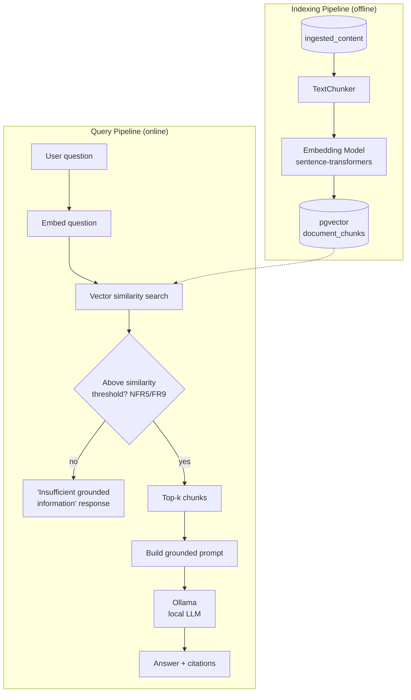

# Feature 0004: Enterprise AI Knowledge Assistant (RAG)

## Problem Statement

Feature 0002 leaves extracted document text sitting in
`ingested_content.extracted_text` as plain text — searchable only via
exact SQL string matches, with no way to ask a natural-language
question and get an answer synthesized from across the corpus. In a
real enterprise context, nobody wants to grep through dozens of RFPs
and technical manuals by hand to answer "what security requirements
came up across our recent proposals?"

This feature builds a Retrieval-Augmented Generation (RAG) pipeline:
extracted text is chunked and embedded into a vector store, and a
locally-run LLM answers natural-language questions by retrieving the
most relevant chunks and grounding its answer in them — with citations
back to the source document, never presenting an unsupported claim as
fact.

## Functional Requirements

| ID | Requirement |
|----|-------------|
| FR1 | The system shall chunk extracted text (RFPs, technical manuals) into overlapping segments suitable for retrieval. |
| FR2 | The system shall generate vector embeddings for each chunk using a locally-run embedding model. |
| FR3 | The system shall store chunk embeddings in PostgreSQL (via `pgvector`), linked back to the source document's checksum for traceability. |
| FR4 | Given a natural-language question, the system shall retrieve the top-k most semantically similar chunks. |
| FR5 | The system shall generate a grounded natural-language answer using a locally-run LLM (via Ollama), given the question and retrieved chunks. |
| FR6 | Every answer shall cite the source document(s) it was grounded in. |
| FR7 | The indexing pipeline shall be idempotent: re-running it must not create duplicate embeddings for chunks already indexed. |
| FR8 | The system shall expose a CLI to ask questions and receive answers. |
| FR9 | If no chunk is found above a minimum similarity threshold, the system shall respond that it lacks sufficient grounded information, rather than generating an answer without retrieved context. |

## Non-Functional Requirements

| ID | Requirement |
|----|-------------|
| NFR1 | **Reproducibility**: chunking and embedding parameters are fixed/configurable, producing deterministic output for the same input. |
| NFR2 | **Testability**: chunking and retrieval logic are unit-testable without requiring Ollama or a live vector store. |
| NFR3 | **Self-hosted**: no external API calls for embeddings or generation — both run locally, consistent with "Open Source First." |
| NFR4 | **Observability**: every query logs retrieval hit count, chunk sources used, and generation latency. |
| NFR5 | **Groundedness**: an answer is only produced when backed by retrieved context above a similarity threshold; this is enforced in code, not left to the LLM's own judgment. |
| NFR6 | **Extensibility**: the embedding model and LLM backend are swappable via configuration (Strategy/Factory pattern, consistent with the rest of the codebase). |

## Architecture Overview

**Indexing flow**: reads every `excel_requirements`-independent text
record (RFPs, technical manuals) from `ingested_content`, chunks it,
embeds each chunk, and stores it in a new `document_chunks` table with
a `pgvector` column.

**Query flow**: embeds the incoming question with the same model,
performs a vector similarity search against `document_chunks`. If
nothing clears the similarity threshold, the system returns an explicit
"I don't have grounded information for this" response (FR9/NFR5) rather
than letting the LLM improvise. Otherwise, the retrieved chunks are
assembled into a prompt and sent to a local Ollama model, and the
answer is returned together with the source document(s) it came from.

## Design Decisions

1. **`pgvector` in the existing PostgreSQL instance**, not a dedicated
   vector database (Milvus/Weaviate/Qdrant). Reuses infrastructure
   already running, avoids adding a new service to operate, and matches
   "Open Source First." See ADR-0007 for the full trade-off.

2. **A new, independent uv project** (`backend/knowledge_assistant/`),
   continuing the ADR-0003 pattern. It depends on `shared_core` (ADR-0006)
   to read `ingested_content` — the fourth module to consume that
   package, which is exactly the payoff ADR-0006 was built for.

3. **`document_chunks` stays local to this module**, not added to
   `shared_core`. Unlike `document_metadata`/`ingested_content`, no
   other module reads or writes this table — per ADR-0006's own
   principle, a table is only extracted into the shared package once a
   second owner or reader genuinely needs it, not preemptively.

4. **Fixed-size token chunking with overlap** (not semantic/structural
   chunking) as the first iteration — simple, deterministic, and
   sufficient to validate the pipeline end-to-end. Smarter chunking is
   listed under Future Improvements once the basic pipeline is proven.

5. **Explicit groundedness check before calling the LLM** (FR9/NFR5):
   if retrieval returns nothing above the similarity threshold, the
   system never calls the LLM at all — the fallback response is
   generated by our own code. This is a deliberate design decision to
   prevent hallucination, not a hope that the model will "know when it
   doesn't know."

6. **Factory pattern for embedding model and LLM backend** (NFR6),
   the fourth application of this pattern in the codebase (after
   document generators, parsers, and classifiers) — the same
   proven extensibility approach applied consistently.

## Trade-off Analysis

| Decision point | Option chosen | Alternative considered | Why |
|---|---|---|---|
| Vector storage | `pgvector` extension on existing PostgreSQL | Dedicated vector DB (Milvus, Weaviate, Qdrant) | No new service to run/operate; sufficient performance at this data volume (hundreds, not millions, of chunks). Revisit if corpus size grows by orders of magnitude. |
| Chunking strategy | Fixed-size token chunks with overlap | Semantic/structural chunking (split on headings/sections) | Simpler, deterministic, library-agnostic first iteration; validates the pipeline before investing in smarter (and harder to test) chunking logic. |
| Embedding model | Local `sentence-transformers` model | Commercial embeddings API (OpenAI, Cohere) | Keeps "Open Source First," avoids per-call cost and an external dependency; acceptable quality trade-off at this scale. |
| LLM backend | Small local model via Ollama | Larger model / hosted LLM API | Runs on personal hardware without a dedicated GPU; answer quality risk is mitigated by grounding heavily in retrieved context rather than relying on the model's own knowledge. |

## Testing Strategy

- **Unit tests** for `TextChunker`: verify chunk boundaries and overlap
  behavior against known input text.
- **Unit tests** for retrieval logic using a fake in-memory vector store
  (cosine similarity over small fixture embeddings) — no live
  PostgreSQL/`pgvector` required.
- **Unit test** for the groundedness fallback (FR9): confirm the LLM is
  never called when no chunk clears the similarity threshold.
- **Manual end-to-end validation** against a real Ollama instance and
  live `pgvector`, following the same approach used to validate the
  real Airflow DAG in Feature 0002 — genuinely calling a local LLM in
  an automated test is heavier infrastructure than this phase's testing
  budget justifies.

## Related ADRs

- ADR-0003: Module structure (pattern reused for this fourth module).
- ADR-0006: Shared schema package (`ingested_content`, read by this
  feature — the mechanism's first real payoff).
- ADR-0007: Vector store and LLM backend choice (`pgvector` + Ollama).

## Future Improvements

- Semantic/structural chunking instead of fixed-size token chunks.
- Re-rank retrieved chunks with a cross-encoder for better precision.
- Extend retrieval to structured Excel requirement data, not just
  chunked free text.
- Swap in a larger Ollama model via the existing factory once/if
  hardware allows.
- A simple web UI on top of the CLI, once later phases stabilize.
