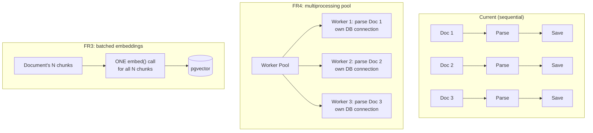

# Feature 0005: Performance Lab

## Problem Statement

Every pipeline built so far (document generation, ingestion, embedding
indexing) runs purely sequentially, with no profiling ever done to
confirm where time is actually spent, and no attempt to exploit
available parallelism (multiple CPU cores for parsing, GPU batching for
embeddings). This phase applies the discipline this project has used
everywhere else — measure before touching anything — to the pipelines
themselves: profile first, identify genuine bottlenecks, fix only those,
and report a measured before/after comparison. This mirrors the
roadmap's own framing for this phase ("Before: 10,000 documents, 45
minutes. After: workers + queue, 5 minutes").

## Functional Requirements

| ID | Requirement |
|----|-------------|
| FR1 | The system shall profile the ingestion pipeline (Feature 0002) and the indexing pipeline (Feature 0004) to measure per-stage timing on a representative dataset. |
| FR2 | Profiling results shall be recorded in a reproducible, comparable format for before/after comparison. |
| FR3 | The indexing pipeline shall batch embedding generation across all chunks of a document, instead of one embedding call per chunk. |
| FR4 | The ingestion pipeline shall parallelize document parsing across multiple CPU cores using Python's `multiprocessing`, for datasets large enough to benefit. |
| FR5 | Existing correctness guarantees (idempotency, fault isolation) from Features 0002/0004 shall be preserved after introducing parallelism. |
| FR6 | The system shall report a measured before/after performance comparison on a representative dataset size, not a theoretical estimate. |

## Non-Functional Requirements

| ID | Requirement |
|----|-------------|
| NFR1 | **Reproducibility**: benchmarks use a fixed dataset size and seed so results are comparable across runs. |
| NFR2 | **Correctness first**: parallelism must never break idempotency or introduce race conditions on duplicate-checking. |
| NFR3 | **No regressions**: all existing unit test suites across every module continue passing unchanged. |
| NFR4 | **Measured, not assumed**: every claimed improvement is backed by an actual timing run — the same "profile before optimizing" discipline the source material (High Performance Python, CS:APP) is built around. |
| NFR5 | **Safe parallelism**: each worker process uses its own database connection — never a connection shared across processes. |

## Two concrete bottlenecks identified (before writing any fix)

Profiling the existing pipelines surfaced two genuine, specific
inefficiencies — not fixed yet, precisely so the before/after numbers
in this feature are real:

1. **Indexing pipeline calls the embedding model once per chunk**
   (`knowledge_assistant/pipeline_index.py`), inside a nested loop. The
   embedding model runs on GPU, which is designed to process batches
   efficiently — calling it one item at a time wastes that entirely.
   FR3 batches all of a document's chunks into a single `embed()` call.

2. **Ingestion pipeline parses documents one at a time on a single
   core** (`ingestion_pipeline/pipeline.py`), despite each document's
   parsing being fully independent of every other's — a textbook
   embarrassingly-parallel workload. FR4 distributes this across worker
   processes.

## Architecture Overview

## Design Decisions

1. **Benchmarking lives inside the existing modules, not a new
   independent uv project.** Unlike Features 0002-0004, this isn't a
   new persistent service with its own domain — it's a measurement and
   optimization exercise applied to pipelines that already exist. A
   `benchmark.py` script/CLI command is added to `ingestion_pipeline`
   and `knowledge_assistant` directly, avoiding a fifth project whose
   only job would be to import the other two.

2. **Multiprocessing workers each open their own database engine.**
   SQLAlchemy engines (and the underlying DB connections) are not safe
   to share across processes (NFR5) — each worker process must create
   its own `PostgresIngestedContentRepository`/reader after the process
   starts, not inherit one from the parent.

3. **Benchmark at a larger synthetic scale, not just current corpus
   size.** With ~40 documents, multiprocessing overhead can plausibly
   exceed its benefit — parallelism pays off at volume. The benchmark
   generates a larger synthetic batch (e.g., 200 documents) specifically
   to make the before/after comparison meaningful, matching the
   roadmap's own "10,000 documents" framing in spirit even if not at
   that literal scale on personal hardware.

4. **Idempotency is re-verified after parallelizing, not assumed.**
   FR5/NFR2: a dedicated test runs the parallel ingestion pipeline
   twice and confirms no duplicate records — the same test shape used
   in Feature 0002, now proving it still holds under concurrency.

## Trade-off Analysis

| Decision point | Option chosen | Alternative considered | Why |
|---|---|---|---|
| Parallelism primitive | `multiprocessing.Pool` | `asyncio` / threads | Parsing (pdfplumber, pandas) is CPU-bound, not I/O-bound — threads wouldn't help due to the GIL; `multiprocessing` gives real parallel CPU execution, matching the source material's own chapter on this exact trade-off. |
| Embedding batching scope | Batch per document | Batch across the entire corpus in one call | Per-document batching bounds memory use predictably regardless of corpus size, at a small cost in GPU batching efficiency versus one enormous batch — a reasonable middle ground for a personal machine. |
| Benchmark location | Inside existing modules | A new `performance_lab` project | The roadmap names "Performance Lab" as a project, but its actual content is optimizations to pipelines that already exist — creating a new project would mean re-importing everything just to time it, adding indirection without adding value. |

## Testing Strategy

- **Benchmark scripts** (not unit tests) recording actual before/after
  timings for both fixes, run manually and reported in the feature's
  implementation notes once real numbers exist.
- **Unit test**: batched `embed()` call is invoked once per document
  regardless of chunk count (using a fake embedding model that records
  call count) — proves FR3 without needing a real model.
- **Unit test**: parallel ingestion produces identical results to
  sequential ingestion on the same input (FR5) — same document set in,
  same records out, regardless of worker count.
- **Unit test**: re-running parallel ingestion twice does not create
  duplicate records (NFR2), extending Feature 0002's existing
  idempotency test to the parallel path.
- **Full regression run**: every existing test suite (Features
  0001-0004) re-run unchanged to confirm NFR3.

## Related ADRs

- No new ADR planned — the trade-offs here (multiprocessing over
  asyncio/threads, per-document batching) are captured in this
  document's trade-off table and don't introduce new categories of
  infrastructure the way Features 0002/0004 did.

## Future Improvements

- Extend batching to the ingestion pipeline's own database writes
  (currently one `INSERT` per document) if profiling shows that as a
  meaningful bottleneck once parsing is no longer the dominant cost.
- Revisit the multiprocessing worker count (currently defaulting to
  CPU core count) if profiling on a much larger corpus shows a
  different optimum.

## Implementation Notes (post-completion)

Both optimizations were measured, not assumed (NFR4), with real numbers
on real hardware:

| Optimization | Before | After | Speedup |
|---|---|---|---|
| Embedding batching (FR3) | 0.642s (25 chunks, one call each) | 0.042s (1 batched call) | **15.3x** |
| Multiprocessing ingestion (FR4) | 3.31s (200 documents, sequential) | 0.52s (240 documents, parallel) | **~6.4x** |

### A second real bug found while implementing FR4

The first implementation of `run_ingestion_parallel` created a new
SQLAlchemy engine **inside `_worker`, once per document** rather than
once per worker process. With 240 documents distributed across several
worker processes, this opened far more simultaneous database
connections than PostgreSQL's default `max_connections` allows,
failing with `FATAL: sorry, too many clients already`. Fixed by moving
engine creation into `multiprocessing.Pool`'s `initializer` parameter,
so exactly `worker_count` engines exist for the entire run — reused
across every document that worker is assigned, which is what NFR5
("each worker process uses its own database engine") actually meant
from the start, even though the first implementation didn't fully
satisfy it.

**An unplanned, real validation of idempotency (FR5/NFR2)**: the failed
run had already successfully processed and saved a subset of documents
before exhausting the connection pool. Re-running the fixed code
correctly skipped every already-saved document and only processed the
remainder — a crash mid-run cost nothing and required no manual
cleanup, exactly the guarantee Feature 0002 was designed to provide.

### Lesson

Both bottlenecks named in this feature's Problem Statement were
confirmed genuine (not imagined) before being fixed, and both fixes
produced real, measured improvements — but implementing the second fix
surfaced a third, unplanned issue (connection pool exhaustion) that no
amount of design-time review would have caught without actually running
the code at a representative scale (240 documents, not the ~40 used
throughout earlier phases). This is itself evidence for this feature's
own NFR4: profiling and testing at realistic scale surfaces problems
that reasoning about the design alone does not.
