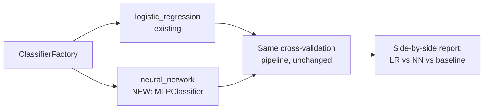

# Feature 0006: Document Understanding — Deep Learning Classifier

## Problem Statement

Phase 3 established a classical ML baseline for requirement
classification: Logistic Regression, 83.5% accuracy vs. a 17.5%
majority-class baseline (ADR-0004/ADR-0005). Phase 6 extends the
existing `ClassifierFactory` (Feature 0003, Design Decision 4) with a
feedforward neural network — the deep learning technique this phase's
source material (Goodfellow et al.) centers on — and evaluates it with
the exact same methodology already built, to answer a genuine question
honestly: **does a neural network actually improve on Logistic
Regression for this dataset**, rather than assuming "deep learning" is
automatically better.

This is a hypothesis to test, not a foregone conclusion. With ~200
examples across 8 classes, a simple linear model over TF-IDF features
is a strong baseline; neural networks typically need substantially more
data to show their advantage. Reporting whichever result actually
occurs — including "the simpler model won" — is more valuable and more
honest than only reporting favorable outcomes.

## Explicit scope decision: table extraction and OCR deferred

The roadmap names three Phase 6 techniques: advanced classification,
table extraction, and OCR. Only the first has real content to validate
against in this project's synthetic corpus:

- **Table extraction**: no generated PDF (RFP or technical manual)
  contains an embedded table — structured data lives only in the Excel
  generator's output (Feature 0001), which is already read as
  structured rows, not extracted from a rendered table.
- **OCR**: every generated PDF is text-native (built with `fpdf2`
  writing real text), not a scanned image — there is nothing in this
  corpus OCR would meaningfully be tested against.

Building either now would mean writing code with no real data to prove
it works — the same anti-pattern this project avoided in Feature 0004
(RAG) and Feature 0005 (Performance Lab) by insisting on measured
evidence. Both remain real Future Improvements, with a concrete
prerequisite noted: extending `TechnicalManualGenerator` to embed an
actual table, and adding a scanned-image variant to the document
generator, before either technique has something genuine to work
against.

## Functional Requirements

| ID | Requirement |
|----|-------------|
| FR1 | `ClassifierFactory` shall support a new `neural_network` model type (a feedforward network) without any change to the training/evaluation pipeline itself. |
| FR2 | The neural network shall be evaluated with the identical stratified k-fold cross-validation methodology already used for Logistic Regression (ADR-0005), on the identical dataset. |
| FR3 | The system shall report a direct, side-by-side comparison of Logistic Regression vs. neural network performance — not just each against the baseline separately. |
| FR4 | The better-performing model (by cross-validated accuracy) shall be the one persisted as the default artifact. |

## Non-Functional Requirements

| ID | Requirement |
|----|-------------|
| NFR1 | **Reproducibility**: identical seed and fold assignment across both models being compared. |
| NFR2 | **No regressions**: the existing Logistic Regression path and its tests continue working unchanged. |
| NFR3 | **Fair comparison**: neural network hyperparameters (hidden layer size, iteration count) are reasonable defaults for a dataset this size, not tuned to favor either model's outcome. |

## Architecture Overview

No new module, no new infrastructure — this is a single new entry in
an already-proven extension point:

## Design Decisions

1. **Reuses `backend/requirement_classifier/` entirely** — no new uv
   project. This is the second real test of the Factory pattern's
   extensibility promise from Feature 0003 (the first was
   Excel→correlated-vocabulary; this is the literal "add Decision
   Tree/Random Forest/SVM later" scenario the factory was built for).

2. **`MLPClassifier` (scikit-learn)** for the neural network, not a
   PyTorch/TensorFlow model. It implements the same `fit`/`predict`
   interface as `LogisticRegression`, so it plugs into the existing
   `Pipeline` (TF-IDF + classifier) and cross-validation code with zero
   changes — and it genuinely is a feedforward network (the book
   chapter this phase is built around), just via a lighter-weight
   library appropriate for a dataset this size.

3. **The comparison is reported explicitly, win or lose.** Following
   ADR-0005's own principle (never trust a number without a baseline),
   this feature reports LR vs. NN vs. majority-class baseline together,
   whatever the actual result turns out to be.

## Testing Strategy

- **Unit test**: `ClassifierFactory.create("neural_network", seed)`
  returns a fitted-compatible estimator (same interface contract as
  `logistic_regression`).
- **Unit test**: cross-validating the neural network on the existing
  synthetic fixture dataset (same one used in Feature 0003's tests)
  produces valid `CrossValidationResult` output, structurally identical
  to the Logistic Regression path.
- **Regression check**: all existing Feature 0003 tests continue
  passing unchanged (NFR2).

## Related ADRs

- No new ADR — this reuses ADR-0004/ADR-0005's existing decisions
  without introducing a new category of infrastructure.

## Future Improvements

- Table extraction, once `TechnicalManualGenerator` (or a new
  generator) produces PDFs with genuine embedded tables to validate
  against.
- OCR, once a scanned-image document variant exists in the generator.
- Hyperparameter tuning (grid search) for the neural network, if the
  initial honest comparison shows it's competitive enough to be worth
  the extra complexity.

## Implementation Notes (post-completion)

The hypothesis stated in the Problem Statement was confirmed, not
assumed: Logistic Regression outperformed the neural network on this
dataset.

| Model | Accuracy | Precision | Recall | F1 |
|---|---|---|---|---|
| Baseline (majority class) | 17.5% | 2.2% | 12.5% | 3.7% |
| Logistic Regression | **83.5%** | 85.9% | 82.0% | 82.3% |
| Neural Network (MLP) | 79.0% | 78.8% | 78.3% | 77.5% |

(All values are the mean across 5 stratified cross-validation folds, on
the same 200 real generated requirements used throughout Phase 3.)

Both models comfortably beat the baseline, confirming ADR-0004's
correlated vocabulary still produces a genuinely learnable signal. But
the simpler linear model won by roughly 4.5 percentage points of
accuracy — consistent with the well-known pattern that neural networks
need substantially more data than ~200 examples to outperform strong
linear baselines on bag-of-words-style text features. `compare`
correctly persisted Logistic Regression as the default artifact (FR4),
since the comparison logic picks the actual winner rather than
preferring either model by default.

This result is treated as a successful outcome of this feature, not a
disappointing one: the goal was an honest, evidence-based comparison,
and that is exactly what was produced. A different dataset size or
feature representation could change this outcome — which is precisely
why the comparison is run fresh each time (`compare`), rather than
hard-coding an assumed winner.
