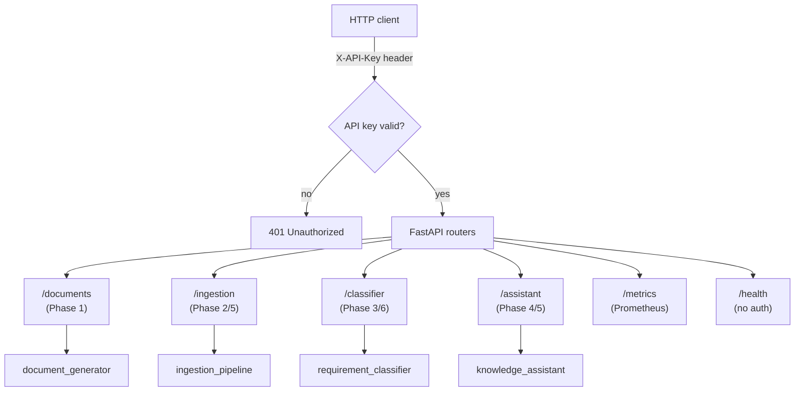

# Feature 0007: Product Hardening — API, Auth, Observability, CI/CD

## Problem Statement

Six phases produced four genuinely working backend capabilities
(document generation, ingestion, requirement classification, and a RAG
knowledge assistant) — but each is only reachable through its own
separate CLI, with no authentication, no observability, and no
automated testing on push. This is fine for a personal development
workflow, but it doesn't resemble anything a real product or team could
depend on. Phase 7 closes the roadmap by unifying these four
capabilities behind a single FastAPI service, adding baseline security
and observability, and automating testing via CI — turning a
collection of scripts into something that behaves like a deployable
product.

## Functional Requirements

| ID | Requirement |
|----|-------------|
| FR1 | A FastAPI application shall expose HTTP endpoints for: generating documents (Phase 1), triggering ingestion (Phase 2/5), training/comparing/classifying requirements (Phase 3/6), and indexing/querying the knowledge assistant (Phase 4/5). |
| FR2 | Every endpoint except a health check shall require API key authentication. |
| FR3 | The API shall expose a Prometheus-compatible `/metrics` endpoint reporting request counts and latencies per endpoint. |
| FR4 | A GitHub Actions workflow shall run the full unit test suite (all five modules) on every push/PR to `main`. |
| FR5 | A consolidated top-level architecture document shall summarize the full system across all seven phases, for a reader encountering the repository for the first time. |

## Non-Functional Requirements

| ID | Requirement |
|----|-------------|
| NFR1 | The API layer calls directly into each module's existing functions/pipelines — it reimplements no business logic (Open/Closed, once more). |
| NFR2 | Authentication must not block automated testing — the test suite runs against the API without requiring a real deployed secret. |
| NFR3 | Observability adds negligible latency to request handling (in-process metrics collection, not an external call per request). |
| NFR4 | CI completes in a practical amount of time (a few minutes) by running only the unit test suites already proven to need no live infrastructure. |

## Explicit scope boundary: what CI does NOT validate

CI runs the unit test suites already built across every phase — all of
which were deliberately designed to need no live database, no Airflow,
no Ollama, and no GPU (that discipline is why they can run in CI at
all). CI does **not** re-run the real end-to-end validations performed
manually in Features 0002/0004/0005 (the live Airflow DAG, real Ollama
inference, real multiprocessing against Postgres) — those require
infrastructure a CI runner doesn't have, and would need to be
containerized wholesale to automate, which is out of scope here. This
is a documented boundary, not an oversight: CI validates that the code
is correct, not that every piece of infrastructure is reachable.

## Architecture Overview

## Design Decisions

1. **A new independent uv project** (`backend/api/`), depending on
   `shared_core`, `document_generator`, `ingestion_pipeline`,
   `requirement_classifier`, and `knowledge_assistant` via `uv add
   --editable`. It is added to `backend/pyproject.toml`'s workspace
   `exclude` list **immediately** after `uv init`, before any other
   `uv` command — the standing procedure from ADR-0003, now applied a
   third time from the very start rather than reactively.

2. **API key authentication**, not JWT or OAuth2. A single key read
   from an environment variable, checked via a FastAPI dependency on
   every route except `/health`. This is the appropriate level of
   security for a single-operator portfolio API — a full identity
   provider would be solving a multi-tenant problem this project
   doesn't have, the same "avoid overengineering" reasoning already
   applied to vector storage (ADR-0007) and model persistence
   (ADR-0005).

3. **`prometheus-fastapi-instrumentator`** for metrics, not hand-rolled
   middleware. It auto-instruments request count/latency per route with
   a few lines of setup, and is the standard, well-maintained way to
   get Prometheus metrics out of a FastAPI app — reinventing this would
   add risk without adding anything the library doesn't already do
   correctly.

4. **GitHub Actions runs each module's test suite as its own job**,
   mirroring this project's own module isolation (ADR-0003): a failure
   in one module's tests doesn't need to block reporting results for
   the others, and each job installs only that module's own
   dependencies via its own `uv sync`.

5. **Grafana is explicitly deferred**, not included in this feature.
   The `/metrics` endpoint alone is the meaningful deliverable — it is
   what makes a dashboard possible, but standing up Grafana itself (a
   new Docker service, dashboard JSON, provisioning config) with a
   single operator viewing it occasionally is more infrastructure than
   this project's current scale justifies. Tracked as a Future
   Improvement.

## Trade-off Analysis

| Decision point | Option chosen | Alternative considered | Why |
|---|---|---|---|
| Authentication | API key via header | JWT / OAuth2 / a real identity provider | A single-operator portfolio API has no multi-user or delegated-access problem to solve; an identity provider would be complexity with no corresponding requirement. |
| Metrics library | `prometheus-fastapi-instrumentator` | Hand-rolled middleware | A well-maintained library correctly handles edge cases (path templating, exception paths) that a first attempt at custom middleware likely would not. |
| CI scope | Unit tests only | Full live-infrastructure end-to-end tests in CI | Standing up Postgres+pgvector, Airflow, and Ollama inside CI just to automate what's already been manually validated three times would be substantial infrastructure investment for marginal additional confidence. |
| API module structure | New `backend/api/` project | Add API code to one of the four existing modules | The API is cross-cutting by nature (depends on all four); attaching it to any single existing module would misrepresent its actual scope. |

## Testing Strategy

- **Unit tests** for the auth dependency: a request without a valid API
  key is rejected (401); a request with a valid one passes through.
- **Unit tests** for each router's request/response handling, using
  the same fake/in-memory repositories already built in each underlying
  module — the API layer's own tests never need a live database either.
- **CI workflow itself** is the integration test for FR4 — its
  successful execution across all module jobs is the acceptance
  criterion.

## Related ADRs

- No new ADR planned for authentication or metrics library choice —
  captured in this document's trade-off table; neither introduces a
  new *category* of infrastructure risk the way pgvector/Ollama did
  (ADR-0007).

## Future Improvements

- Grafana dashboard consuming the `/metrics` endpoint.
- Rate limiting per API key, if this is ever exposed beyond localhost.
- A minimal web frontend (per Enzo's earlier question) consuming this
  API — deliberately scoped as a follow-on to the API itself being
  stable first, not built simultaneously.
